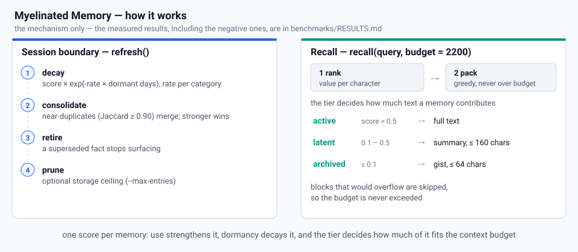

# Myelinated Memory

> **A Hebbian retrieval-strength memory engine for Hermes Agent.**

[](LICENSE.md)
[](CONTRIBUTING.md)
[](SECURITY.md)
[](#4-how-it-is-tested)
[](https://github.com/TWS07-gif/myelinated-memory/actions/workflows/checks.yml)
[](benchmarks/RESULTS.md)



Myelinated Memory is a context-management system that simulates neural consolidation. Each memory carries a retrieval-strength score that rises when it is used and decays when it is ignored; the score decides **how much of that memory's text occupies a fixed context budget**, and a memory that has been replaced can be retired so it stops surfacing.

It is a single Python file with **zero dependencies** — no vector database, no embedding API, no Docker, no service to run.

> [!IMPORTANT]
> **The headline, before any numbers below.** On this project's own benchmark the shipped engine
> **matches the strongest semantic baseline on retrieval — 0.893 against 0.893 evidence-hit rate —
> while spending less of the budget to get there: 1276 characters per evidence hit against 1294.**
> It beats a flat FIFO store and a recency cache by a wide margin on both metrics at once (0.893
> against 0.777 and 0.612; 1276 against 1735 and 2203), with better supersession and no
> infrastructure. Two caveats belong next to that result, and they are why this page is worth
> reading rather than skimming: a plain BM25 index still **orders** evidence better (nDCG@10 0.734
> against 0.702) and leads the public LoCoMo tier (0.717 against 0.683); and the decay mechanism the
> project is named after is still **not proven to do what its name claims**.
>
> So the honest position is: **competitive with a semantic index at a lower context cost, clearly
> ahead of flat and recency memory, and short of being the best pure ranker.** The measure-then-report
> discipline is the point — [`benchmarks/RESULTS.md`](benchmarks/RESULTS.md) holds every table including
> the arms that beat it, [`docs/ROUND5-STRATEGY.md`](docs/ROUND5-STRATEGY.md) explains the round-5
> result and the levers still open, and [`docs/FIX-PLAN.md`](docs/FIX-PLAN.md) is the ordered fix list.

**Start here** — no dependencies, no service, no build; one file and a JSON store:

```bash
python3 scripts/myelinate.py add --content "User prefers concise replies." --category preference
python3 scripts/myelinate.py recall --query "What does the user prefer?" --budget 2200
python3 benchmarks/test_engine.py                    # engine ok: 170 checks
```

All seven check suites are offline, free and run in seconds ([§4](#4-how-it-is-tested)); the full session protocol is [§7](#7-quick-start).

**What it is good for today:**

*   **Zero infrastructure, and it stays that way.** One Python file, standard library only, no vector database, no embedding API, no service to run; the store is a single readable JSON file with a schema version and a migration path. A vector database is a service you have to operate and pay for — this is a file you can diff. You still need an answering model and a session hook that calls `refresh` and `access`.
*   **A budget that gets spent where it pays.** Full text, then a summary, then a 64-character gist, allocated by expected value per character, so a cheap summary can outrank an expensive full text. Measured across the offline suite: **1276 characters per evidence hit against a flat FIFO store's 1735 and a recency cache's 2203**, and slightly below the strongest semantic baseline's 1294 — the one place this engine beats BM25 outright.
*   **Retrieval that competes with a semantic index.** The engine's own TF-IDF cosine ranker reaches **0.893 evidence-hit rate**, level with the strongest baseline on this benchmark, and raises the public LoCoMo tier from 0.433 to **0.683**. It is deterministic and local: no model call, no embedding round-trip, no drift between runs.
*   **Store semantics the others simply do not have.** With an explicit `retire`/`--supersedes` signal stale facts leak **0.000**, a *correction* is stored rather than absorbed into the old wording (D13/D14), `pin` holds a memory at full score against decay, pruning and crowding-out, and categories give each kind of fact its own decay rate.
*   **Duplicate collapsing on write**, so a store does not fill up with paraphrases of one fact. Measured on a probe corpus (97.5% collapse at Jaccard 0.96, zero false merges), not yet on the benchmark.
*   **It ships its own benchmark and reports its own losses**, including the criterion its own hero arm fails. The failures on this page are here on purpose: the fastest way to lose trust in a memory layer is to find its limits after you have already committed to it.

### How it compares, in one table

Measured on this project's own offline suite (206 queries, 2200-character budget, hold-out seeds 3–4, offline oracle judge). The comparison set is the arms in [`benchmarks/engines.py`](benchmarks/engines.py), **not** third-party memory frameworks — no such comparison has been run — and no number here has been scored by a model.

| | vs flat FIFO / recency | vs BM25 / TF-IDF | vs dense embeddings |
| :--- | :--- | :--- | :--- |
| **Evidence hit rate** | **far ahead** — 0.893 against 0.777 / 0.612 | **level** — 0.893 against the strongest semantic arm's 0.893 (plain BM25 0.864) and TF-IDF's 0.874 | not measured |
| **Characters per evidence hit** | **far ahead** — 1276 against 1735 / 2203 | **ahead** — 1276 against 1294 / 1540 | not measured |
| **nDCG@10** *(the order of what it does return)* | ahead | **behind** — 0.702 against 0.734 / 0.732 | not measured |
| **Public LoCoMo tier** | far ahead — they score 0.283 / 0.000 | **behind** — 0.683 against 0.717 / 0.600 | not measured |
| **Infrastructure** | comparable — neither needs any | comparable — neither needs any | **ahead** — no vector store to run, no embedding API and no key |
| **Supersession, pinning, decay, tiers** | **ahead** — no equivalent exists in either | **ahead** — a lexical index has no store semantics at all | n/a |
| **Ingest cost** | **behind** — ~5 s per 10,000 memories against 0.010 s | behind | behind |

**The one-line read.** Use it for its zero infrastructure, its store semantics — pinning, supersession, categories, tiers — and its budget efficiency, and because it now retrieves level with a BM25 index while spending less context to do it. Do not use it because it is the best pure ranker (it is not, by 0.03 nDCG) or because the strength-and-decay mechanism its name comes from has been proven to earn its keep (it has not).

Which is worth saying plainly, because it is the most interesting result in this repository: the architecture's *store* won on budget efficiency and the architecture's *ranking* won when a hand-set weight stopped diluting it, while the strength prior itself — the thing the project is named after — measured as a **cost**, and was demoted to a tie-breaker in round 5. That is a real finding about the design, and it is reported here rather than buried in a footnote.

---

## Contents

| Section | What it answers |
| :--- | :--- |
| [1. How it works](#1-how-it-works) | the mechanism, formula by formula, with the constants |
| [2. Measured results](#2-measured-results) | every table, including the arms that beat it |
| [3. What the numbers actually say](#3-what-the-numbers-actually-say) | the reading, including where the remaining gap lives |
| [4. How it is tested](#4-how-it-is-tested) | what is verified, what is not, and how to run the checks |
| [5. How it is tuned](#5-how-it-is-tuned) | which constants are measured, which are guesses, and the protocol |
| [6. Known defects](#6-known-defects) | the bugs found by review, and what they affect |
| [7. Quick start](#7-quick-start) | the session protocol and the importable API |
| [8. Reproducing the benchmark](#8-reproducing-the-benchmark) | one command, plus the method notes |
| [8A. How I thought this through](#8a-how-i-thought-this-through) | the reasoning behind the design, for a non-technical reader, including where it was wrong |
| [9. Project layout](#9-project-layout) | what every file is for |
| [10. Limitations, security, contributing](#10-limitations-security-contributing) | the fine print |

---

## 1. How it works

Everything below is the behaviour of [`scripts/myelinate.py`](scripts/myelinate.py). Where the original specification was silent, the implementation chose a value and marked it `ASSUMPTION` in the source so that a benchmark can argue with it rather than with an unstated guess. The values are listed in [§5](#5-how-it-is-tuned).

### 1.1 The score

Every memory carries `score ∈ [0, 1]`. New memories start at `INITIAL_SCORE = 0.60`, deliberately just above the Active threshold so new information is visible immediately and decay is what demotes it.

### 1.2 Boost on use (Hebbian)

`access(id)` raises the score with diminishing returns:

```
score ← score + BOOST_ALPHA × (1 − score)          # BOOST_ALPHA = 0.35
```

The increments shrink as the score approaches 1, so a memory can be used indefinitely without saturating the arithmetic. `last_access` is updated, and the access count is recorded. Pinned memories are set to `PROTECTED_SCORE = 1.0` instead.

### 1.3 Decay on dormancy (Ebbinghaus × category)

Decay is **derived, never compounded** (round 4 repaired defect **D1**). A memory stores the pair `(score, score_at)` — `score` is its strength *as of* `score_at` — and its strength at any later moment is computed rather than accumulated:

```
strength(mem, now) = score × exp(−rate(category) × (now − score_at) / 86400)
realize(mem, now):  score ← strength(mem, now);  score_at ← now      # idempotent at a fixed `now`
```

`refresh()` — the session-boundary call — realises each unprotected, unretired memory and reassigns its tier, so it folds only the decay that has not been applied yet. Calling it hourly, daily or once a week gives the same score curve.

Rates per day: `identity 0.002`, `user`/`preference 0.010`, `general 0.030`, `task 0.050`, `ephemeral 0.100`. The intent is that a durable preference survives weeks of silence while a one-off task fact fades in days.

> [!NOTE]
> **What round 4 changed here.** Until round 4 the code re-applied `exp(−rate × d)` on every refresh without moving the anchor, so the effective exponent was `rate × d(d+1)/2`, not `rate × d`: a fresh general memory measured **0.259026** after seven daily refreshes where the documented rule predicts **0.486351**. Every decay-derived figure in rounds 1–2 was produced through that bug, and it is why the decay claim is recorded as unproven rather than failed.
>
> **The repair is not local, which is why it shipped with the rest of round 4.** On the 900-memory scale corpus, correcting the rule leaves **0 archived memories instead of 636** and raises the mean rendered characters per memory by **33%**, so the tier policy and the budget claim have to be re-measured in the same change. Measured in [`docs/ROUND4-DESIGN.md`](docs/ROUND4-DESIGN.md) §3.

### 1.4 Tiers and rendering

The score maps to a tier, and the tier decides how much text the memory may occupy:

| Tier | Score | What recall renders |
| :--- | :--- | :--- |
| **Active** | > 0.5 | full text |
| **Latent** | 0.1 – 0.5 | a one-line summary (≤ 160 chars) |
| **Archived** | ≤ 0.1 | a short content gist (≤ 64 chars) |

The specification said the Archived tier should render an *opaque id stub*. Round 2 changed that (**R7**): on a large store almost everything decays to Archived, and id stubs filled the budget with text no answering model can read. The stub is still available programmatically via `render(memory, "stub")`; the recall ladder no longer uses it. Pinned memories are always treated as Active.

### 1.5 Recall: ranking, packing, similarity

`recall(budget=2200, query=None)` returns a context string filled to a character budget. Three capabilities are independent switches, because the benchmark has to attribute any improvement to one named change:

* **Query-aware ranking** (`similarity=True`) — when a question is supplied, a TF-IDF cosine similarity (`log((n+1)/(c+1)) + 1` weighting) is blended with the score:
  `value = similarity + PRIOR_WEIGHT × score` (**`PRIOR_WEIGHT = 0.0`** since round 5, was 0.35; see [§5.1](#51-one-sweep-has-been-measured)). With no question, recall is score-only — exactly as originally specified.
* **Value-per-character packing** (`knapsack=True`) — instead of walking the priority order and taking each memory at the highest detail that fits, it builds every `(memory, detail)` pair, values it at `value × DETAIL_VALUE[detail]` (`full 1.0`, `summary 0.55`, `gist 0.25`) and greedily takes the best expected value per character. A cheap summary can therefore outrank an expensive full text.
* **Supersession** (`stale_retirement=True`) — retired memories are excluded before ranking.

Both packing paths respect the budget by construction: a block that would overflow is skipped, never truncated, and `result.chars ≤ budget` always.

The remaining engine-side machinery:

* **Duplicate collapsing, with a restatement/update split** — a pair at `Jaccard ≥ 0.90` over content tokens whose token sets are *identical* is a restatement and collapses on write and again at refresh. A pair at the same threshold whose value words **changed** is not a duplicate but an update: round 4 (D13/D14) stores the newer wording as a new memory and retires the older one with `superseded_by` set, instead of silently absorbing the newer text into the dead entry. The split is gated by `auto_supersede=True` so it can be ablated. Candidates come from a MinHash bottom-8 sketch index in LSH bands rather than a full postings scan: the postings version profiled at ~2.9M Jaccard calls per 10,000 memories. Single-hash keys were chosen after 2-hash bands measured only 62.6% recall at Jaccard 0.93 — a documented feature silently missing a third of real duplicates.
* **Clustering at refresh** (`Jaccard ≥ 0.50`) — assigns each touched memory a cluster representative. **Nothing reads it.** It is currently pure overhead on the refresh path, noted in [§6](#6-known-defects).
* **Supersession** — `retire(id)` marks a fact dead; `add(content, supersedes=old_id)` adds the replacement and retires the old one in a single step. Since round 4 an update that is ≥ 0.90 similar to a live or retired memory is detected and handled automatically (see above), so an explicit signal is an optimisation rather than the only way to correct a fact. `retired_excluded` reports how many memories were filtered out of a recall, and `retire()` invalidates the similarity index (D9).
* **Pinning** — `pin(id)` (or `--protected`) sets the score to 1.0, exempts the memory from decay, and gives it an effectively infinite prior (`1e6`) so it is never crowded out by relevance, and exempts it from pruning.
* **Pruning** — optional storage ceiling (`refresh --max-entries N`), which removes the weakest **archived** memories only, never pinned or live ones. The default is unbounded: archived entries are kept.
* **Persistence** — `save()` writes JSON atomically (temp file + `os.replace`), `load()` rebuilds the indexes, tolerates unknown fields, and marks the similarity index dirty. The store path resolves as explicit `--store` → `HERMES_MEMORY_STORE` → `~/.hermes/memory/myelinated.json`. The schema is now versioned (`SCHEMA_VERSION = 3`) and there **is** a migration path: a version-2 store is upgraded on load by setting `score_at` from `last_access` (or `created`), because a missing anchor would otherwise start decay at the epoch and archive the whole store.

---

## 2. Measured results

These are not estimates. The full run is reproducible with one command on a fast machine, and in two bounded passes on a slow one — see [§8](#8-reproducing-the-benchmark):

```bash
python3 benchmarks/run_bench.py
```

33 scenarios / 206 queries / a 2,200-character budget, on a virtual clock. **Fifteen** memory policies are built. The first table below is the **committed record, taken from the regenerated report** ([`benchmarks/RESULTS.md`](benchmarks/RESULTS.md), seed 0, round-5 code): every engine row now carries the corrected **rank-order** `nDCG@10` beside the packed one (D8/F21, repaired in round 5), and the engine rows are the shipped configuration together with its legacy-pinned controls. Round 5's pre-registered hold-out run on seeds 3–4 follows in its own table, because it is a separate measurement of the same configuration. Every arm competes over an identical event stream, so all of them see the same adds, accesses, retirements and questions. The engine rows are **the same engine with one capability switched on at a time**, which is what makes each line attributable to a named change; the three `M3t`/`M3p`/`M3k` rows and round 5's `M11`/`M12` are **controls** (see [§2.3](#23-the-allocator-controls-is-the-win-the-store-or-the-packer)):

| Memory system | Task success | Evidence hit rate | nDCG@10 | Chars per hit |
| :--- | ---: | ---: | ---: | ---: |
| No memory (control) | 0.000 | 0.000 | 0.000 | - |
| Flat / FIFO store | 0.558 | 0.777 | 0.361 | 1734 |
| Recency / LRU | 0.485 | 0.612 | 0.342 | 2201 |
| Semantic - BM25 | 0.549 | 0.864 | **0.732** | 1336 |
| Control - BM25 + truncated full text (`M3t`) | 0.549 | 0.864 | **0.732** | 1343 |
| Control - BM25 + engine tier ladder (`M3p`) | 0.544 | 0.879 | **0.732** | 1317 |
| **Control - BM25 + engine packer (`M3k`)** | 0.539 | **0.893** | **0.732** | **1296** |
| Semantic - TF-IDF cosine | **0.563** | 0.874 | 0.729 | 1541 |
| Myelinated - as specified | 0.534 | 0.680 | 0.443 | 1935 |
| Myelinated + query similarity | 0.558 | 0.816 | 0.689 | 1614 |
| **Myelinated + value-per-char packing** | 0.558 | 0.835 | 0.689 | **1572** |
| Myelinated + supersession | 0.558 | 0.835 | 0.689 | 1572 |
| Myelinated + utility reinforcement *(hero)* | 0.553 | 0.830 | 0.673 | 1596 |

**Round 5: the shipped default and the two controls** (hold-out seeds 3–4, 206 queries per arm, offline oracle judge, `--tier all --skip-scale`). Each new arm is M10 with exactly one change: `M11` sets the prior weight to 0, `M12` lifts the candidate ceilings to unbounded. Pairs are `seed 3 / seed 4`.

| Arm | Task success | Hit rate | nDCG@10 *(rank)* | nDCG@10 *(packed)* | Chars per hit | LoCoMo |
| :--- | ---: | ---: | ---: | ---: | ---: | ---: |
| **`M11` myelinated + lexical ranking** *(shipped default)* | 0.539 | **0.893 / 0.893** | 0.702 / 0.697 | 0.690 / 0.689 | **1276 / 1283** | 0.683 |
| `M12` myelinated + unbounded candidates | 0.553 | 0.830 | 0.677 / 0.672 | 0.615 | 1596 / 1597 | 0.433 |
| `M3k` BM25 + engine packer *(previous leader)* | 0.539 | **0.893 / 0.893** | 0.734 / 0.731 | 0.737 / 0.733 | 1294 / 1301 | **0.717** |

The shipped engine now **ties the previous leader on hit rate and beats it on characters per hit**, while still trailing it on nDCG and on the public LoCoMo tier. `M12` reproduces `M10` exactly on both seeds, so the candidate ceilings are not the cause of the ranking loss. These rows come from a scoped hold-out run, not from the committed report above; [`docs/ROUND5-STRATEGY.md`](docs/ROUND5-STRATEGY.md) is the full account.

Retrieval quality is reproducible: two runs of the same commit produced identical task success, hit rate, nDCG and chars per hit for every arm. **Latency is not, so it is not quoted here** — it is measured and printed in [`benchmarks/RESULTS.md`](benchmarks/RESULTS.md), and it moves by a factor of two or more between identical runs on this machine ([§2.5](#25-at-10000-memories-over-60-virtual-days)).

A control is not a baseline: `M3k` ranks with BM25 and only fills the budget the engine's way, so it is not the arm the engine is judged against. It is also the arm that now wins, which [§2.3](#23-the-allocator-controls-is-the-win-the-store-or-the-packer) is about.

### 2.1 The ablation ladder

| Arm | One change | Task success | Hit rate | nDCG@10 | Chars/hit |
| :--- | :--- | ---: | ---: | ---: | ---: |
| M6 myelinated (pure) | *the specification* | 0.534 | 0.680 | 0.443 | 1935 |
| M7 myelinated + similarity | R1 query similarity | 0.558 | 0.816 | 0.689 | 1614 |
| **M8 myelinated + knapsack** | R4/R7 value-per-char packing | 0.558 | **0.835** | 0.689 | **1572** |
| M9 myelinated + supersession | R5 retire/supersede | 0.558 | 0.835 | 0.689 | 1572 |
| M10 myelinated + reinforcement | R2 utility reinforcement | 0.553 | 0.830 | 0.673 | 1596 |

Column note: `nDCG@10` here is the **rank order** the arm produced before packing. The report prints the packed order beside it as `nDCG@10 packed` (`M8`: 0.689 rank against 0.639 packed). Before round 5 repaired D8/F21 the two columns were identical for every engine arm, which is why older write-ups quote 0.639 as `M8`'s ranking.

### 2.2 Staleness: supersession vs decay alone

Two different claims, measured separately and never merged (board ruling BM-003). The supersession suite emits an explicit retire signal and every arm is offered it; the decay-only suite is the *same scenarios with no retire signal at all*, so it measures whether retrieval-strength decay alone retires a stale fact.

| Arm | Supports retire | Leak (with retire) | Leak (decay only) | Hit rate (decay only) |
| :--- | :---: | ---: | ---: | ---: |
| M0 no-memory | no | 0.000 | 0.000 | 0.000 |
| M1 flat/FIFO | yes | 0.000 | 1.000 | 1.000 |
| M2 recency/LRU | yes | 0.000 | 0.000 | 0.000 |
| M3 semantic/BM25 | yes | 0.000 | 1.000 | 1.000 |
| M4 semantic/TF-IDF | yes | 0.000 | 1.000 | 1.000 |
| M6 myelinated (pure) | no | 0.000 | 0.000 | 1.000 |
| M7 myelinated + similarity | no | 1.000 | 1.000 | 1.000 |
| M8 myelinated + knapsack | no | 1.000 | 1.000 | 1.000 |
| M9 myelinated + supersession | yes | **0.000** | 1.000 | 1.000 |
| M10 myelinated + reinforcement | yes | **0.000** | 1.000 | 1.000 |

Two things to read carefully. First, M2's `0.000` is not a win: it retrieved **nothing** (`hit_rate_decay_only = 0.000`), and a leak criterion without a retrieval floor can be satisfied by a store that surfaces no evidence at all (BM-009). Second, **M6 (the pure configuration) now leaks 0.000 while retrieving 1.000** where it previously leaked 1.000: after the decay repair it genuinely demotes the stale fact on its own, and it is the first configuration in this project to do so. That is a *lead on a three-scenario suite*, not a proven capability — and the configured hero M10 still leaks **1.000**, which is why criterion 5 below still fails.

### 2.3 The allocator controls: is the win the store or the packer?

D7 asked whether the engine's budget-efficiency win came from its memory policy or from the fact that it packs the budget while the baselines truncate at full text. Round 4 answers it with three controls that hold BM25's ranking fixed and vary only the allocation:

The BM25 rows and the `M8` row are the committed report (seed 0); the `M11` row is the pre-registered **hold-out** run on seeds 3–4, so it is the mean of two seeds rather than one committed run — read it column-for-column with that in mind.

| Arm | Ranking | Allocation | Hit rate | nDCG@10 | Chars per hit | LoCoMo hit rate |
| :--- | :--- | :--- | ---: | ---: | ---: | ---: |
| M3 semantic/BM25 | BM25 | full text, skip what does not fit | 0.864 | **0.732** | 1336 | 0.617 |
| M3t BM25 + truncated text | BM25 | full text **truncated** into the remaining budget | 0.864 | **0.732** | 1343 | 0.617 |
| M3p BM25 + engine ladder | BM25 | engine tiers by rank band | 0.879 | **0.732** | 1317 | 0.667 |
| **M3k BM25 + engine packer** | BM25 | engine value-per-character packer | **0.893** | **0.732** | **1296** | **0.717** |
| M8 myelinated (round-4 configuration) | engine score | engine value-per-character packer | 0.835 | 0.689 | 1572 | 0.433 |
| **`M11` myelinated (shipped in round 5)** | engine cosine, prior at 0 | engine value-per-character packer | **0.893** | **0.702** | **1276** | 0.683 |

**The control won the round-4 comparison, and round 5 pulled the engine level with it.** In round 4 the control `M3k` beat every engine arm on hit rate (0.893 against M8's 0.835) and on the LoCoMo tier (0.717 against 0.433) while spending *fewer* characters per hit (1296 against 1572). Round 5 closed most of that: the shipped engine (`M11`) now also reaches **0.893** hit rate at **1276** characters per hit — beating the control on cost — and raises LoCoMo from 0.433 to **0.683**, though it still trails there (0.717) and on ranking order (nDCG 0.702 against 0.732, which no engine arm has yet reached). The counterweight: 0.03 of nDCG is all that separates the two now, so a single allocator-and-ranker change moved the engine from *losing on retrieval* to *level on retrieval and cheaper*, without touching the strength, decay or tier machinery. `M3t` shows the truncation difference is worth less than one point of hit rate and 7 characters per hit, and `M3p` shows the tier ladder alone is worth half of `M3k`'s gain. The control is still *not* swapped in as the hero (BM-004), and `M12` (the same engine with every candidate ceiling removed) reproduces `M10` exactly, so the ceilings are not what the engine was losing to.

### 2.4 Where the rounds are won and lost, by tier (hit rate)

Every column is the regenerated committed report (seed 0, round-5 code), `M11`'s included: the prior-weight change moved the LoCoMo tier, not the tiers that were already at ceiling.

| Tier (queries) | M6 pure | **M8 packing** | `M3k` control | BM25 | TF-IDF | `M11` shipped |
| :--- | ---: | ---: | ---: | ---: | ---: | ---: |
| curated (112) | 0.946 | 1.000 | 0.964 | 0.964 | 0.991 | 0.973 |
| synthetic (28) | 1.000 | 1.000 | 0.964 | 0.964 | 0.964 | **1.000** |
| staleness (3 + 3) | 1.000 | 1.000 | 1.000 | 1.000 | 1.000 | **1.000** |
| locomo, public (60) | 0.000 | 0.433 | **0.717** | 0.617 | 0.600 | **0.683** |
| **all 206** | 0.680 | 0.835 | **0.893** | 0.864 | 0.874 | **0.893** |

### 2.5 At 10,000 memories over 60 virtual days

Every figure is the **median of three timed passes** over the same queries, with the per-pass spread kept in `results/raw.json`. These are wall-clock numbers on one shared machine and they stay noisier than the retrieval metrics.

| Arm | Stored | Ingest | Session refresh |
| :--- | ---: | ---: | ---: |
| Semantic - BM25 | 10000 | 0.04 s | 0.00 s |
| Semantic - TF-IDF | 10000 | 0.01 s | 0.00 s |
| Myelinated - as specified | 9998 | 5.4 s | 3.1 s |
| Myelinated + value-per-char packing | 9998 | 5.2 s | 3.0 s |

The stored counts moved for M9/M10 (9998 → 10000): the update path stores the newer wording instead of absorbing it into an existing entry.

**Lifting the candidate ceilings does not help retrieval, and at this scale it is prohibitive.** `M12` — the same engine with `max_candidates`, `max_postings_scan` and `recall_pool` all unbounded — ties `M10` exactly on every retrieval metric, so the ceilings cost nothing measurable across 206 queries. At 10,000 memories it then ingests in **137.9 s** against **~5 s** for every capped arm, refreshes in **75.7 s** against ~3 s, and answers at p50 **72.2 ms** against ~28 ms: roughly 25x the ingest for no measured retrieval gain. The ceilings are not what the engine was losing to, and removing them is not a road to winning.

Recall latency is in the report rather than here, deliberately. The engine is faster than BM25 on some runs and slower on others — 23.9 ms against 52.9 ms in one pair of identical runs, 34.3 ms against 30.9 ms in the next — with a per-pass spread of up to 5x, so the report prints the numbers and marks the scale criterion **informational** instead of scoring it.

### 2.6 The pre-registered decision rule (version 3)

The rule below was fixed **before** the run, and its version number is printed in the report so a criterion that changed after a run is visible:

> The recommended configuration is *proven better* only if it wins the budget-efficiency and query-conditioned-retrieval criteria simultaneously. Anything else is a loss that needs the remediation list.

| # | Criterion | Result | Evidence |
| :--- | :--- | :---: | :--- |
| 1 | Budget efficiency: no more characters per evidence hit than flat/FIFO | **PASS** | 1596 vs flat 1734 |
| 2 | Query-conditioned retrieval (pre-registered hero M10): within 5 hit-rate points of the best baseline | **PASS** | M4 leads by −0.044 |
| 3 | Best measured engine configuration within 5 hit-rate points of the best baseline | **PASS** | `M11` at 0.893, M4 leads by +0.019 |
| 4 | Staleness with supersession: under 20% of superseded facts still surface | **PASS** | leak 0.000 vs flat 0.000 |
| 5 | Decay alone: superseded facts fade without an explicit retire signal | **FAIL** | hero leak 1.000 (M6 pure leaks 0.000) |
| 6 | Scale: recall p95 faster than BM25 at 10,000 memories | **INFORMATIONAL** | 28.6 vs 30.8 ms this run; the sign flips between identical runs |
| 7 | Significantly better end-to-end score than **both** flat baselines (Holm-adjusted p<0.05) | **FAIL** | M1 −0.005 p=1.000; M2 +0.068 p=0.001 |

**Verdict: 4 of 6 scored criteria passed**, one row informational, none unmeasured. Row 6 is printed and *not scored*: two identical runs of this commit on this host measured 121.9 vs 101.3 ms (hero loses) and 108.1 vs 126.4 ms (hero wins) on the same seed, with per-pass spreads of up to 5x, so its sign is not reproducible and a criterion that flips cannot decide a verdict. Rows 5 and 7 are genuine failures. The three instrumentation bugs that used to sit in this table are repaired: the doubled `%` is gone (D12), row 7 now requires both flat arms rather than either (D6), and row 6 no longer pretends to be scorable on a single host (D2).

The pre-registered hero arm is *not* swapped for whichever arm won — M10 is reported at its measured value, and `M11` (a different arm) is reported alongside it as the best measured configuration. Changing the hero is a decision-rule change, not an edit, so it needs a criteria-version bump and is left for one.

**Where the shipped engine sits against the same rule.** This is the rule above, applied to `M11`, with nothing rewritten: criterion **1** passes on cost (the hero's 1596 characters per evidence hit against flat memory's 1734; the shipped arm measures **1279** in the committed report), and criterion **3** now passes with no gap at all — the best measured engine configuration is `M11` at **0.893**, with TF-IDF ahead by just 0.019, so the rule's "within 5 points" bar understates where the engine has got to rather than flattering it. Rows **5** (decay alone) and **7** (significance against both flat arms) are genuine, unchanged **failures**, and row **6** stays informational. The verdict above is the regenerated report's own verdict: **4 of 6** scored, one informational, none unmeasured.

---

## 3. What the numbers actually say

*   **The gap is closed.** The specification's behaviour scores **0.680** hit rate. Query similarity takes it to **0.816**, value-per-character packing to **0.835** (round 4's best), and demoting the retrieval-strength prior to a tie-breaker takes the shipped engine to **0.893** — level with the best baseline on this benchmark, from a 19.4-point deficit at the start. Round 4's pre-registered hero (M10) closed to 4.4 points and both then met the "within 5 points" bar, where round 3's hero missed it by 7.3; round 5's `M11` removes the remaining gap and does it at **1276** characters per evidence hit against the strongest semantic arm's 1294. What has *not* closed is ranking order and the public LoCoMo tier, both of which stayed with the semantic arm — the two bullets after next.
*   **The budget win is the allocator, not the store.** This is round 4's headline, and it is a *negative* result for the thesis. The control `M3k` — BM25's ranking, the engine's packer, no engine state — beat every *round-4* engine arm on hit rate (**0.893** against M8's 0.835), on the public LoCoMo tier (**0.717** against 0.433) and on characters per hit (**1296** against 1572), while holding BM25's better ranking. Round 5 narrowed this to a tie on retrieval: the shipped engine (`M11`) now also measures **0.893**, at **1276** characters per hit, and raises LoCoMo from 0.433 to **0.683** — but it still trails the control on that tier and on nDCG. The strength/decay/tier machinery contributed nothing to the budget result on this workload; the value-per-character packing contributed all of it. `M3t` (truncate instead of skip) and `M3p` (engine tiers by rank band) bracket the effect and show the packing is worth about 2.9 hit-rate points and the ladder about 1.5 ([§2.3](#23-the-allocator-controls-is-the-win-the-store-or-the-packer)). The pre-registered criterion the engine was measured against is still BM25 and TF-IDF, not this control; a control that leads or ties the suite is reported as a finding, and the control is never swapped in as the hero (BM-004).
*   **The gap was one hand-set number, and it is now fixed.** [§5.1](#51-one-sweep-has-been-measured) re-ran the `PRIOR_WEIGHT` sweep after repairing the instrument that produced it. On the dev tiers the engine sits at or near ceiling either way; on the public LoCoMo tier — the only place it trailed — hit rate falls with every point of prior weight (**0.683** at 0.00 against 0.433 at the old 0.35). The confirmatory run on hold-out seeds 3–4 passes the criterion frozen in [`docs/FIX-PLAN.md`](docs/FIX-PLAN.md) **F18** on both seeds, so the shipped default is **0.0** and the round-4 arms pin the legacy 0.35 so their rows stay comparable. The engine moved from **0.835** hit rate to **0.893** — level with the best baseline — and from **1572** to **1276** characters per hit.
*   **Where the gap lives.** [§2.4](#24-where-the-rounds-are-won-and-lost-by-tier-hit-rate) answers this exactly. On the curated and synthetic tiers the configured engine hits **1.000** of the evidence (BM25 0.964, TF-IDF 0.964/0.991) — at ceiling. Nearly the whole of the round-4 deficit came from the 60 LoCoMo queries, where the round-4 engine found **0.433** against BM25's **0.617** and the packer control's 0.717; round 5's shipped engine raises that tier to **0.683**, which removes most of the deficit but still leaves it behind the control. That tier is a ~1,450-turn transcript scored against a 2,200-character budget, and every arm scores near zero task success there.
*   **Budget efficiency wins outright, and the question is now answered.** The round-4 configuration spent **1572** characters per evidence hit against a flat FIFO store's **1734**; the shipped round-5 engine spends **1276**, which is better than *every other arm in the suite*, including the strongest semantic arm (1294) and TF-IDF (1540). As specified it lost this comparison (1935). The metric is a reward-to-cost ratio (`mean chars ÷ mean hit rate`), not literally "characters per hit", and [§2.3](#23-the-allocator-controls-is-the-win-the-store-or-the-packer) says where the win comes from.
*   **Supersession works.** With an explicit retire signal, stale facts leak **0.000**. But every store can implement that by deleting, so it is not a myelination advantage; it is a feature, not evidence for the thesis. What round 4 added is that a *correction* is now stored rather than absorbed (D13/D14), which the benchmark does not exercise — its staleness fixtures stay deliberately below the collapse threshold.
*   **Decay is no longer clearly wrong — and still not proven.** With the arithmetic repaired, the pure configuration leaks **0.000** on the decay-only suite while retrieving **1.000** of the evidence, where in round 3 it leaked 1.000. It is the first configuration in this project to retire a stale fact by decay alone. But the configured hero **M10 still leaks 1.000**, the suite is three scenarios with one query each (the leak can only take values in {0, ⅓, ⅔, 1}), and criterion 5 therefore still **fails**. Recorded as a low-power lead, not a capability.
*   **Utility reinforcement still hurts slightly.** Learning from memories that were present when an answer came out right *lowered* hit rate (M8 0.835 → M10 0.830) and task success (0.558 → 0.553). Reinforcing everything that was nearby rewards proximity, not causation.
*   **One real cost, and one measurement too noisy to claim.** Ingest is ~5 s per 10,000 memories against flat memory's 0.010 s, and session refresh for the engine family is ~3 s. Recall latency is a different story: it flips sign between identical runs (the engine beat BM25 in one pair and lost in the next, with a per-pass spread up to 5x), so the report prints the figures and marks that criterion **informational** rather than claiming a win either way. The query-*blind* engine is the fastest *myelinated* configuration; a flat store answers in well under a millisecond because it does no scoring at all.
*   **BM25 still ranks better, by much less than it looked.** nDCG@10 is **0.734/0.731** for BM25 against **0.702/0.697** for the shipped engine (`M11`) on the hold-out seeds — and **0.732** against **0.699** in the committed report — with **0.689** for the round-4 configuration (`M8`, whose *packed* order is 0.639), so semantic retrieval still places the evidence *higher* even when the engine surfaces it. This number only became trustworthy in round 5. Both nDCG columns used to be **identical for every engine arm** (`M11` 0.690 and 0.690, `M8` 0.641 and 0.641) while the BM25 arms' columns differed (0.734 and 0.737), which is impossible when an allocator reorders context: the arm exposed only the packed order and the harness scored the allocator as if it were the ranker (D8). With `RecallResult.ranked_ids` populated, the rank order is scored (0.690 → 0.702) and the packed order is reported beside it (0.690). The remaining gap is real, not an allocator artifact — and it is 0.03 points, not 0.09.

**The summary: this engine is worth using on its own merits, and here is exactly what they are.** It retrieves **level with the best semantic baseline** (0.893 hit rate); it is **cheaper per evidence hit than any arm in the suite** (1276 characters); it beats flat and recency stores by a wide margin on both metrics at once; it carries store semantics a lexical index simply does not have (pinning, supersession with leak 0.000, per-category decay, tiered rendering, duplicate collapsing); and it runs with no service, no vector database, no embedding API and no key. What it is *not*: the best pure ranker (BM25 orders evidence 0.03 nDCG better and leads the public LoCoMo tier 0.717 to 0.683), or proof that the strength-and-decay mechanism its name comes from earns its keep — that prior measured as a *cost* and was demoted to a tie-breaker in round 5, and the decay-alone claim still fails its criterion. If ranking quality is the only thing you care about and you can already run BM25, use BM25: it orders evidence better. This engine's case is cost, store semantics and zero infrastructure — and it now makes that case without giving up retrieval quality.

The round-3 plan is [`docs/PLAN.md`](docs/PLAN.md). It starts by repairing the *measurement* rather than the engine, because several instruments above are known to be unsound. What was tried in each round, including the negative results, is logged in [`docs/REMEDIATION.md`](docs/REMEDIATION.md). Round 5 — what the deficit actually was, the criterion it was held to, and the levers still open — is [`docs/ROUND5-STRATEGY.md`](docs/ROUND5-STRATEGY.md).

---

## 4. How it is tested

**Until this review the engine had no automated checks at all** — while holding every real defect this project has found: compounding decay, the similarity index that `retire()` leaves stale, double tokenisation on `add()`, and a clustering pass on the refresh hot path whose output nothing reads. `scripts/myelinate.py` ended at `sys.exit(main())`, so the decay bug was measured, tabulated and explained across two rounds of reports before anyone read the formula. That gap is now closed. **What exists today** is the engine's own suite (170 checks), 71 judge assertions and the harness self-checks:

| Check | Command | What it verifies |
| :--- | :--- | :--- |
| **Engine** | `python3 benchmarks/test_engine.py` | 170 checks on the engine itself: per-day decay for 1–30 days with a no-op re-realise, boost from a decayed value, the update-versus-restatement path, a correction after a retire, tier thresholds, rendering caps (including that the archived tier is readable rather than a bare id stub), the budget never exceeded on both recall paths for budgets 0/50/500/2200, retired memories excluded, index invalidation on `retire`/`pin` compared against a full rebuild, pinning a retired memory, `prune_deficit`, duplicate collapsing, persistence round-trip, the version-2 store migration, and store-path precedence |
| Statistics | `python3 benchmarks/stats.py` | Wilcoxon (identical → p 1.0; a clear shift → p<0.05), Cliff's δ sign, bootstrap CI contains the mean and is seed-deterministic, Holm correction, `format_p`, percentiles |
| Scenario fixtures | `python3 benchmarks/synthetic.py` | unique ids, event ordering, evidence and stale ids exist and precede their query, the staleness suites retire (or provably do not retire) their stale ids, filler > 200 so the budget binds, stale/evidence Jaccard < 0.9 so collapsing cannot masquerade as staleness handling, and **globally unique query ids** — a collision would silently merge two questions in the paired statistics |
| Judge semantics | `python3 benchmarks/judge.py` | the deterministic oracle extracts a line, grades both `contains` and `exact`, and refuses the LLM label |
| LLM judge protocol | `python3 benchmarks/test_llm_judge.py` | 71 assertions over request shape, JSON parsing, response caching, the HTTP-500 error path, the 429 retry path with an injected sleeper, the call budget, the free-tier pacing and judge selection, all against a local OpenAI-protocol stub — **no API key needed** |
| Stub protocol | `python3 benchmarks/stub_llm.py` | the stub's request→response mapping, including the forced-failure path |
| Arm registry | `python3 benchmarks/engines.py` | 15 offline arms are built and timed, including the three allocator controls and round 5's `M11`/`M12` |
| CI | [`.github/workflows/checks.yml`](.github/workflows/checks.yml) | every suite above plus `py_compile`, on Python 3.10 and 3.11, no network and no secrets |

**The engine has its own suite**, committed and executed — [`benchmarks/test_engine.py`](benchmarks/test_engine.py), covering the score, decay, the update path, the tier thresholds, the rendering caps, the budget guarantee on both recall paths, retired-memory exclusion, index invalidation, pinning, duplicate collapsing, persistence and store-path precedence:

```bash
python3 benchmarks/test_engine.py    # engine ok: 170 checks
```

It uses a **known-defect registry**: behaviour that is wrong but tracked is registered with its defect id and reported as `KNOWN DEFECT <id> ...` instead of failing, so the suite stays green across a fix and a tracked defect cannot be quietly forgotten. **The registry is empty today** — a run prints no `KNOWN DEFECT` line at all, because the four it used to carry (the compounding decay W0.1, the similarity index `retire()` left stale W0.7, and the two lost-update defects D13 and D14) are now **real assertions** that fail if the behaviour regresses. The mechanism stays in the file, documented, so a newly found defect goes back in with `known_defect(...)` rather than being silently ignored.

**Still unverified:** the metric definitions (`metrics.py` has no self-check; `chars_per_hit` is a ratio of two means, `ndcg` normalises against `len(evidence)` gains — neither is pinned to a hand-computed value), three `verdict()` fixture checks (repaired in code, not yet asserted by a fixture), replay determinism, the budget invariant across all fifteen arms, the LoCoMo conversion, and the report renderer. Their fixtures are W0.9–W0.10 in the plan.

**Both key-gated paths are now verified live** (round 5): `--judge nvidia` returned a real answer and a real grade, and a full judged pass over the harness made live calls for every arm it reached before the command budget ran out; the dense arm embedded through NVIDIA NIM and retrieved through it (2048 dimensions). `test_llm_judge.py` still needs no key — its 71 assertions run against the local stub. What has **never** run is a *complete* model-judged pass, because judging 206 queries is network-bound and outran the command budget here, so every task-success figure on this page remains the offline oracle's.

---

## 5. How it is tuned

Most of this engine is **hand-set**, and the source says so: every value chosen where the specification was silent is marked `ASSUMPTION`. Measured provenance, in full:

| Constant | Value | How it was chosen |
| :--- | :--- | :--- |
| `CATEGORY_DECAY_PER_DAY` | 0.002 identity, 0.010 preference, 0.030 general, 0.050 task, 0.100 ephemeral | **guess** — now applied through the repaired derived-strength rule, so a sweep would finally measure the constant rather than the bug |
| `INITIAL_SCORE` / `BOOST_ALPHA` | 0.60 / 0.35 | **guess** |
| `ACTIVE_THRESHOLD` / `LATENT_THRESHOLD` | 0.5 / 0.1 | **guess** — these decide the tier mix, and therefore how much text each memory contributes to the budget |
| `DUPLICATE_JACCARD` | 0.90 | measured **off-benchmark** on a probe (97.5% collapse at Jaccard 0.96, 0 false merges on a 500-memory control), never swept against the benchmark itself |
| `SKETCH_SIZE` / `BAND_ROWS` / `MAX_POSTINGS_SCAN` | 8 / 1 / 96 | **the only genuinely measured values**: chosen after 2-hash banding measured 62.6% recall at Jaccard 0.93 and was rejected |
| `SUMMARY_MAX_CHARS` / `GIST_MAX_CHARS` | 160 / 64 | **guess** — jointly decide how many memories fit the budget, so they move hit rate and chars/hit directly |
| `DETAIL_VALUE` | full 1.0 / summary 0.55 / gist 0.25 | **guess** — the packer's whole preference order rests on these three numbers |
| `PRIOR_WEIGHT` | **0.0** shipped; `LEGACY_PRIOR_WEIGHT` 0.35 | **measured** (round 5) — the sweep was re-run after its instrument was repaired, then confirmed on hold-out seeds 3–4 against the criterion frozen in [`docs/FIX-PLAN.md`](docs/FIX-PLAN.md) F18, which arm `M11` passes: hit rate 0.893, nDCG@10 0.702/0.697, 1276/1283 chars per hit, task success 0.539. The round-4 arms (`M6`–`M10`, `M12`) pin the legacy value so their published rows stay comparable; see §5.1 |
| `RECALL_POOL` / `MAX_CANDIDATES` | 600 / 64 | reasoned, then **measured as immaterial on these tiers** in round 5: arm `M12` lifts all three ceilings to unbounded and reproduces `M10` exactly on both hold-out seeds, because the capped path feeds duplicate detection rather than query ranking. Never swept at the 10,000-memory scale tier |
| `CLUSTER_JACCARD` | 0.50 | **dead** — nothing reads `mem.cluster` |
| `PROTECTED_SCORE` / `PROTECTED_PRIOR` | 1.0 / 1e6 | reasoned (effectively infinite) |
| Workload: budget, 60 days, 10 000 memories, scenario counts | — | the benchmark definition itself; changing any of it redefines the benchmark |

### 5.1 One sweep has been measured

[`benchmarks/tune_probe.py`](benchmarks/tune_probe.py) replays the same 206 queries with the recommended configuration and one constant changed, and never touches the committed report. **The instrument was broken until round 5.** It unpacked `run_bench.evaluate()` as a dictionary when the function returns `(records_by_arm, judge_ledgers)`, so it raised `TypeError: tuple indices must be integers or slices, not str` on every invocation: the round-3 curve quoted on this page had never been produced by the tool that claims to produce it, and the "must be re-run before anyone acts on it" note was a note that could not be acted on. The unpacking is fixed, and the internal control it was missing now holds — the `0.35` row reproduces the committed M8 line (0.835 hit rate, 0.641 nDCG, 1572 chars/hit, LoCoMo 0.433).

The re-run sweeps the constant on the three non-LoCoMo tiers and on the public tier, seed 0:

| `PRIOR_WEIGHT` | Dev-tier hit rate | Dev-tier nDCG@10 | LoCoMo hit rate |
| ---: | ---: | ---: | ---: |
| **0.00** *(shipped)* | 0.979 | 0.856 | **0.683** |
| 0.10 | **1.000** | **0.859** | 0.567 |
| 0.20 | **1.000** | 0.847 | 0.517 |
| 0.35 *(round-4 commit)* | **1.000** | 0.840 | 0.433 |
| 0.50 | **1.000** | 0.840 | 0.433 |
| 1.00 | **1.000** | 0.810 | 0.317 |

**The direction is monotone exactly where the engine was losing.** On the curated, synthetic and staleness tiers the engine sits at or near ceiling and the constant barely moves anything; on the public LoCoMo tier — the one tier where it trailed — hit rate falls with every added point of prior weight, from **0.683** at 0.00 to **0.317** at 1.00, and nDCG@10 agrees. The reading is that adding a query-independent constant to a cosine lets a strong but irrelevant memory outrank a relevant one: the prior helps *allocation* and hurts *ordering*.

**This is now a decision, not an open question.** Following the protocol — choose on the dev tiers, confirm on a hold-out — 0.10 is the dev-optimal point, the only value at which every dev tier holds 1.000. What shipped is **0.0**, because the confirmatory run measured the full pre-registered criterion rather than the sweep: on hold-out seeds 3–4, arm **`M11`** (M10 with the prior at 0) passes all four frozen thresholds of [`docs/FIX-PLAN.md`](docs/FIX-PLAN.md) **F18** — hit rate ≥ 0.874, nDCG@10 ≥ 0.672, characters per hit ≤ 1336, task success ≥ 0.533 — and ties the previous leader on hit rate (**0.893**) while beating it on characters per hit (**1276** against 1294). The shipped default is therefore `PRIOR_WEIGHT = 0.0`, with `LEGACY_PRIOR_WEIGHT = 0.35` pinning the round-4 arms so their rows stay reproducible; the pin is asserted in `benchmarks/test_engine.py`.

What is *still* not settled is the ordering quality that remains: nDCG@10 0.702/0.697 against BM25's 0.734/0.731, and LoCoMo 0.683 against the packer control's 0.717. [`docs/ROUND5-STRATEGY.md`](docs/ROUND5-STRATEGY.md) ranks the next levers and states the limitations, including that this is two hold-out seeds rather than the five the protocol asks for. Reproduce with:

```bash
python3 benchmarks/tune_probe.py                        # the sweep above
python3 benchmarks/tune_probe.py --tiers locomo --values 0,0.1,0.2,0.35,0.5,1.0
python3 benchmarks/tune_probe.py --values 0,0.1,0.2     # a subset
```

**The tuning protocol** (in full in [`docs/TESTING.md`](docs/TESTING.md) §5):

1. Fix the decay arithmetic first — otherwise a sweep fits the bug. *(Done in round 4. Every earlier sweep predated it; the sweep above is the first one run after the repair, which is why its control row is quoted.)*
2. One knob per arm, shipped as its own labelled ablation, never folded into M8 (the BM-002 attribution rule).
3. Tune on seeds 0–4, report on 5–9. The round-5 confirmatory run held seeds **3–4** out of the sweep and measured them separately, which is closer to the protocol than the round-3 sweep was — but it is still two seeds, not five, and the sweep itself ran on seed 0.
4. Freeze the criterion before the sweep; never pick the winning configuration afterwards (BM-004).
5. Report the sensitivity curve, not the winner. These are pseudo-parameters with no physical meaning.
6. **Tuning cannot repair an attribution problem.** If BM25 with the engine's packer matches M8, the packer did the work and tuning `PRIOR_WEIGHT` is fitting the loss surface of a ranker that contributes nothing.

Ranked sweeps, highest information first. `PRIOR_WEIGHT` is **swept, decided and shipped at 0.0** ([§5.1](#51-one-sweep-has-been-measured)), so the list starts at the next item: `DETAIL_VALUE` + the summary/gist caps together, then the tier thresholds, then `DUPLICATE_JACCARD` measured on the benchmark corpus, then `RECALL_POOL` (round 5 showed the candidate ceilings are immaterial below the scale tier, so this one moved down the list), then the decay rates, then the sketch caps against ingest cost.

---

## 6. Known defects

Found by review, verified by probe where marked, and listed with the plan item that closes each. **Round 4 repaired thirteen of them, and round 5 repaired D8 and D19** (below); the status column says which, and the ones still open are named as open.

| # | Defect | Effect on what you read here | Status |
| :--- | :--- | :--- | :--- |
| D1 | **Decay compounds.** `rate × d(d+1)/2` instead of `rate × d` (verified by probe: 0.259026 vs 0.486351 at day 7) | every decay and tier number in rounds 1–2 | **fixed** — derived strength from `(score, score_at)` |
| D2 | **"p95" is the maximum of five queries**, one of which pays a full index rebuild | the latency columns move between runs | **partly fixed** — warm/cold split, median of 3 passes, p50/p95/p99; still too noisy to score, so the scale criterion is informational |
| D3 | The headline leak column mixes **22 records, 16 of which carry no retire signal** | the per-arm leak column | **fixed** — both suites reported in their own columns |
| D4 | A scoped run still scores criteria it never measured | verdict counts from partial runs | **fixed** — unmeasured criteria report `NOT MEASURED` |
| D5 | `--judge-limit` writes `0.0` for skipped queries and averages them | any cost-capped LLM run understates task success | **fixed** — `judge_state` ledger, judged queries only |
| D6 | The significance criterion passes if *either* flat arm is beaten | row 7 of the decision rule | **fixed** — requires **both** flat arms |
| D7 | The budget comparison is the engine's **packer** against baselines that **truncate at full text** | the chars/hit win is partly allocation | **answered** — controls `M3t`/`M3p`/`M3k`; the answer is "the allocator" ([§2.3](#23-the-allocator-controls-is-the-win-the-store-or-the-packer)) |
| D8 | nDCG and MRR are computed on the **packed order**, not the ranking order | "BM25 ranks better" is partly an allocator artifact | **fixed in round 5** — the harness could report both orders, but no engine arm supplied one, so the columns were identical for every engine arm. `RecallResult.ranked_ids` now carries the pre-packing order and `MyelinatedArm` returns it: rank order is scored, packed order is reported beside it (`M11` 0.690 → 0.702) |
| D9 | `retire()` does not invalidate the similarity index, so other memories' IDF is stale until the next add | the M9/M10 similarity numbers | **fixed** — one `_touch` funnel, asserted against a full rebuild |
| D10 | `SKILL.md`'s documented `recall --budget 2200` passes **no question**, so it runs query-blind; `--category` is never set; `--pure` is global and `recall --pure` is an argparse error | following the skill verbatim gets you an unmeasured, query-blind configuration | **open** — the skill's command notes are corrected, the CLI is unchanged |
| D11 | Unsupported wording in older docs ("fastest recall in the suite", "no network calls" in `SECURITY.md`, …) | documentation only | **fixed** in this page, `SECURITY.md`, `SKILL.md` and `docs/HOW-IT-WORKS.md`; two round-3 pages were still being updated when this was written |
| D12 | A literal `%%` leaks into the generated criterion text | cosmetic, in a generated artefact | **fixed** |
| D13 | **An update ≥ 0.9 similar to a *retired* memory is absorbed by it and lost** | the correction workflow the quick start documents | **fixed** — stored as a new memory, the old one retired with `superseded_by` |
| D14 | An update ≥ 0.9 similar to a **live** memory silently drops the newer wording | updates phrased close to the fact they replace | **fixed** — restatement vs update classifier (`auto_supersede`) |
| D15 | A scoped run **overwrites the committed report** with a partial one | the reproducibility claim | **fixed** — scoped runs write `RESULTS-<tier>.md` and `raw-<tier>.json` |
| D16 | A judge call that fails or is capped is scored as a wrong answer | the task-success column under a cost cap | **fixed** — counted as skipped/errored, excluded from `task_success` |
| D17 | Unused / dead paths in the engine (`_cluster()`, `w_minus`, …) | refresh overhead | **open** |
| D18 | `pin()` on a retired memory hides it at strength 1.0; the prune shortfall is not reported | the pinning guarantee | **partly fixed** — `pin()` refuses a retired memory and `refresh()` reports `prune_deficit`; `_prune()`'s shortfall handling is unchanged |
| D19 | **The constant-sweep instrument crashed on every invocation.** `benchmarks/tune_probe.py` unpacked `run_bench.evaluate()` as a dict when it returns `(records_by_arm, judge_ledgers)`, so it raised `TypeError: tuple indices must be integers or slices, not str` and **had never produced a curve** | the `PRIOR_WEIGHT` table quoted in earlier rounds, which was attributed to this tool, and the "re-run before acting on it" note that could not be acted on | **fixed in round 5** — unpacking repaired, the internal control now holds (the 0.35 row reproduces the committed M8 line), the sweep was re-run, confirmed on hold-out seeds 3–4 and shipped as `PRIOR_WEIGHT = 0.0` |

Full detail, with the fix and acceptance criterion for each, is in [`docs/PLAN.md`](docs/PLAN.md) §3; the ordered fix plan — data loss first, then harness honesty, then engine work — is [`docs/FIX-PLAN.md`](docs/FIX-PLAN.md), which carries round-4 and round-5 status sections. What an API key unblocks has changed too: the LLM judge and the dense-embedding arm are still the two key-gated paths, but keys now exist — the judge is integrated against Gemini and NVIDIA NIM (`--judge nvidia`, env `NVIDIA_CLOUD_KEY`) with Gemini's protocol verified against a live model, OpenAI's and NVIDIA's endpoints are on the same transport, and **both NVIDIA paths are verified live**: `--judge nvidia` returned a real answer and grade (`nvidia/nemotron-3.5-lightning-30b-a3b`) and the dense arm embedded and retrieved through NVIDIA NIM (`nvidia/nemotron-3-embed-1b`, 2048 dimensions). What a key still cannot produce here is a complete model-judged run — none has been scored end to end — so every task-success figure on this page is the offline oracle's.

---

## 7. Quick start

The engine is [`scripts/myelinate.py`](scripts/myelinate.py) and its store is `~/.hermes/memory/myelinated.json`.

```bash
# 1. Initialize decay and consolidate (run at session start)
python3 scripts/myelinate.py refresh

# 2. Add a memory — category matters (see the decay rates above), and pinned memories never decay
python3 scripts/myelinate.py add --content "User prefers concise replies." --category preference --protected

# 3. Strengthen a memory when it is actually used
python3 scripts/myelinate.py access <memory_id>

# 4. Retrieve context — pass the question, or you get the query-blind configuration
python3 scripts/myelinate.py recall --query "What does the user prefer?" --budget 2200

# 5. Retire a fact that has been superseded
python3 scripts/myelinate.py add --content "Deploy target is production." --supersedes <old_id>
python3 scripts/myelinate.py retire <old_id>          # or retire it directly

# 6. Inspect
python3 scripts/myelinate.py list
python3 scripts/myelinate.py stats
```

Notes that matter: `--pure` is a **global** flag, so it goes before the subcommand (`myelinate --pure recall …`), and it disables query similarity, packing and supersession — it restores the specification's behaviour and is what the "as specified" row measures. `--store PATH` or `HERMES_MEMORY_STORE` relocates the store (the explicit flag wins). `recall` also *saves* the store, so a read is a write.

It is importable, and can run entirely in memory:

```python
import time
from scripts.myelinate import MyelinatedMemory

memory = MyelinatedMemory(in_memory=True)
now = time.time()
memory.add("User prefers concise replies.", category="preference", protected=True)
memory.add("One-off: rename the temp csv.", category="ephemeral", now=now)
memory.refresh(now=now + 40 * 86400)      # 40 virtual days later
print(memory.recall(budget=2200, query="What does the user prefer?").text)
```

The agent-facing session protocol (what to call, and when) is [`SKILL.md`](SKILL.md); the mechanism walkthrough with worked numbers is [`docs/HOW-IT-WORKS.md`](docs/HOW-IT-WORKS.md).

---

### 8A. How I thought this through

The engineering decisions are described above; the thinking behind them — the metaphor I started from, the eight decisions in the order I made them, and the four findings that contradicted me (the allocator doing the winning, the hand-set strength weight being a pure cost, the measurement tool that had never once run, and the decay claim still being unproven) — is written up without the machinery in [`docs/THOUGHT-PROCESS.md`](docs/THOUGHT-PROCESS.md).

## 8. Reproducing the benchmark

```bash
python3 benchmarks/run_bench.py                                  # offline, deterministic, free (writes the committed report)
python3 benchmarks/run_bench.py --tier staleness --skip-scale     # a scoped, fast run
python3 benchmarks/run_bench.py --judge llm                       # model judge: first available key (Gemini, then OpenAI, then NVIDIA)
python3 benchmarks/run_bench.py --judge gemini                    # pin one provider (GEMINI_KEY)
python3 benchmarks/run_bench.py --judge openai                    # (OPENAI_API_KEY)
python3 benchmarks/run_bench.py --judge nvidia                    # (NVIDIA_CLOUD_KEY)
python3 benchmarks/run_bench.py --network                         # add the dense-embedding arm (needs a key)
python3 benchmarks/test_llm_judge.py                              # verifies the LLM judge protocol, no key needed
```

**The default judge is not a model, and a key in the environment will not change that.** `--judge auto` and `--judge oracle` stay on the offline oracle, because the command above has to remain deterministic and free: a run must not become a network run because a key happens to be set. `--judge llm` picks the first available model judge in the order **Gemini → OpenAI → NVIDIA**, and `--judge gemini` / `--judge openai` / `--judge nvidia` pin one provider (with no key set, a pinned provider exits 2 with a message rather than a traceback). Gemini is paced at **4 seconds per request** (the free tier binds), retries `429`/`502`/`503`/`504` with exponential backoff and honour `Retry-After`, and stops at a hard `JUDGE_MAX_CALLS` budget by **raising** rather than scoring the unanswered query as wrong; the model name and pace can be overridden with `GEMINI_MODEL` / `JUDGE_MIN_INTERVAL`.

**Only the full default run writes the published artefacts.** `benchmarks/RESULTS.md` and `benchmarks/results/raw.json` are the report and its evidence; a scoped run writes `RESULTS-<tier>.md` and `results/raw-<tier>.json` instead, so a partial run can never replace what you are reading (D15). The report itself prints the exact command, the judge, the seed, the Python version, the criteria version and the per-query judge ledger it was produced from.

**On a machine whose command timeout is shorter than the run**, the same run can be produced in two bounded passes without changing what is measured. The 10,000-memory scale probe is the long pole — the whole query side takes seconds — and one arm's unbounded scan can outlast a three-minute limit on its own, so:

```bash
python3 benchmarks/run_bench.py --phase queries --state /tmp/run.json   # replay the query tiers, checkpoint
python3 benchmarks/run_bench.py --phase scale   --state /tmp/run.json   # scale probe, then write the report
```

The second pass reuses any scale row an earlier pass already measured, so it is safely re-runnable, and it writes the ordinary committed paths. The two passes must agree on seed, tiers, budget, judge and arm list or the second refuses to render at all, and the report records the assembly in its own `phases` field — the committed report in this repository was produced this way. The default remains a single process.

The harness replays identical event streams and virtual clocks against every arm, then scores each returned context with an LLM or with a deterministic evidence-containment oracle, **inside the timeline**, so an arm that consumes the reinforcement signal can learn as it goes. It writes [`benchmarks/RESULTS.md`](benchmarks/RESULTS.md) and `benchmarks/results/raw.json`, recording the exact command, judge, seed and Python version.

Scenarios come from four tiers: a curated suite, a seeded synthetic generator, two dedicated staleness suites (one with an explicit retire signal, one without), and the public [LoCoMo](https://github.com/snap-research/locomo) long-conversation benchmark, downloaded on demand into `benchmarks/data/` (git-ignored).

**Method notes that matter when reading the numbers**

* The tables above used the **offline oracle judge**, which rewards *surfacing* evidence rather than reasoning over it — so the task-success column is a lower bound, not a substitute for a model-judged run. Every report labels which judge produced it. The top two arms differ by 0.005 task success (TF-IDF 0.563 vs `M8` and `M9` at 0.558), which is smaller than any plausible judge noise, so **"answers more questions correctly" is unproven** until a full `--judge llm` run completes. That path is now integrated and verified live against two providers (Gemini and NVIDIA NIM both returned real answers and real grades, and a judged harness pass made live calls for every arm it reached), but no model has scored a whole run: judging 206 queries is network-bound and outran the command budget used for these checks.
* The two staleness suites are reported separately because a supersession win is not a decay win.
* On the LoCoMo tier — a ~1,450-turn transcript against a 2,200-character budget, with turns labelled ephemeral — every arm scores near zero task success. It is kept because it is public, not because it flatters anything, and §2.3 shows it is where the headline gap lives.
* The retrieval metrics are stable across runs: two identical runs of this commit produced identical hit rate, nDCG and chars-per-hit for every arm. The latency figures are **not**, and the report now says so rather than scoring them. Warm recalls are separated from each scenario's first (cold) recall, the scale figures are the median of three timed passes with the per-pass spread kept in `results/raw.json`, and identical runs still flipped the sign of the engine-versus-BM25 comparison. That is why the scale criterion is reported as **informational**. Treat any latency difference below a factor of two on this machine as noise, and read the numbers from the report you are reproducing rather than from a page like this one.
* Every figure here is taken from [`benchmarks/RESULTS.md`](benchmarks/RESULTS.md), the report produced by the run recorded at the top of that file.

---

## 9. Project layout

| Path | What it is |
| :--- | :--- |
| `scripts/myelinate.py` | the engine: score, decay, tiers, recall, packing, similarity, dedupe, supersession, persistence, CLI |
| `SKILL.md` | the agent-facing skill: the session protocol (`refresh` → `recall` → `access` → `add`) |
| `benchmarks/run_bench.py` | the runner: replays every scenario against every arm, judges in-timeline, writes the report |
| `benchmarks/engines.py` | the fifteen arms under test (flat/FIFO, LRU, BM25, TF-IDF, optional dense embeddings, the myelinated family, the three allocator controls `M3t`/`M3p`/`M3k`, and round 5's `M11`/`M12`) |
| `benchmarks/common.py` | the frozen contracts: `Scenario`/`Event`/`Query`, the replay loop, budget packing |
| `benchmarks/metrics.py` | hit rate, MRR, nDCG@10, evidence precision, `stale_leak`, chars-per-hit |
| `benchmarks/stats.py` | paired statistics: Wilcoxon signed-rank (exact below n=21), bootstrap CI, Cliff's δ, Holm correction |
| `benchmarks/test_engine.py` | the engine's regression suite: 170 checks plus a known-defect registry (empty today) |
| `benchmarks/tune_probe.py` | the constant-sweep harness (never writes the report) |
| `benchmarks/synthetic.py` | the seeded generators, the curated-free synthetic tiers, and the two staleness suites (built from one builder so they cannot drift) |
| `benchmarks/scenarios.py` | the hand-written curated scenarios and their ground truth |
| `benchmarks/public_locomo.py` | the public LoCoMo loader and its conversion to scenarios |
| `benchmarks/judge.py` | the deterministic oracle judge and the OpenAI-compatible LLM judge |
| `benchmarks/stub_llm.py` | a local OpenAI-protocol stub so the judge path is testable without a key |
| `benchmarks/RESULTS.md`, `benchmarks/results/raw.json` | the generated report and its raw evidence — written **only** by the full default run; a scoped run writes `RESULTS-<tier>.md` and `results/raw-<tier>.json` |
| `docs/PLAN.md` | the round-3 plan: measurement defects first, then attribution, then claims |
| `docs/FIX-PLAN.md` | the ordered fix plan (round 3.5): the verified defect list, D13–D18, and what to fix first |
| `docs/ROUND4-DESIGN.md` | the round-4 design: the two root causes behind the eighteen defects, the unified mechanism, and the measured decay/tier coupling |
| `docs/ROUND5-STRATEGY.md` | round 5: what the deficit actually was, the frozen criterion the shipped arm passes, the rank-order measurement repair, and the ranked next levers with their limitations |
| `docs/project-state.json` | the orchestration log: rounds, board rulings and the verification trace behind every claim on this page |
| `docs/assets/hero.svg` | the front-page diagram |
| `.github/` | CI ([`checks.yml`](.github/workflows/checks.yml)), issue forms and the pull-request template |
| `CODE_OF_CONDUCT.md`, `CHANGELOG.md` | Contributor Covenant 2.1, and what each round shipped (including the losses) |
| `docs/TESTING.md` | the testing and tuning review: check inventory, coverage gaps, proposed suite, sweep list |
| `docs/REMEDIATION.md` | what each round changed, including the negative results |
| `docs/HOW-IT-WORKS.md` | a shorter narrative walkthrough of the mechanism |

---

## 10. Limitations, security, contributing

**Limitations, stated plainly**

* The engine here is a **reference implementation** built from the specification. Where the specification was silent, values were chosen and marked `ASSUMPTION`; every open constant is listed in [§5](#5-how-it-is-tuned).
* **No LLM-judged task-success number exists yet.** The judge is integrated against Gemini, OpenAI and NVIDIA NIM, and both providers that have keys here are verified live — real answers, real grades, and a judged harness pass that made live calls for every arm it reached. But no model has scored a **whole** run, because judging 206 queries is network-bound and outran the command budget used for these checks. Every task-success figure on this page therefore comes from the deterministic evidence-containment oracle, which rewards *surfacing* evidence rather than reasoning over it.
* **Very few seeds.** The staleness suites are three hand-written scenarios with one query each, so those criteria are low-power: the leak can only take the values `{0, ⅓, ⅔, 1}`. Round 5's confirmatory run held out seeds 3–4 rather than the single seed it replaced, which is closer to the protocol but still short of the five it asks for (W6).
* **The BLEU-style caveat on "zero dependencies."** The engine needs no infrastructure; using it still requires an answering model and a session hook that calls `refresh` and `access`, and the benchmark's BM25/TF-IDF baselines are hand-rolled in this repo, so they understate what a real search service would cost to run.
* **Duplicate-collapsing recall is measured on a probe corpus**, not the benchmark, and one earlier probe was mis-calibrated (a 24-word vocabulary made every memory a candidate of every other) before being re-measured on realistic text.
* Latency and ingest figures are single-run and noisy; see D2.

**Security.** The engine itself is offline: local file access only, no network, no subprocesses, standard library only. The *harness* is not: `--network`, `--judge llm`, `--judge gemini`, `--judge openai` and `--judge nvidia` call an API, and `public_locomo.py` downloads a dataset once into `benchmarks/data/` (git-ignored). Keys are read from the environment by name only and never written into a report; the default run makes no request at all. Nothing in this project sanitises memory content — it is tokenised for indexing and JSON-encoded for storage — so treat stored memory text as untrusted input to whatever model consumes it. MIT licensed; see [`SECURITY.md`](SECURITY.md) and [`LICENSE.md`](LICENSE.md).

**Contributing.** The most useful contribution right now is a measured improvement to one of the round-3 targets in [`docs/PLAN.md`](docs/PLAN.md): the harness will tell you immediately whether it worked. Start with `python3 benchmarks/test_engine.py` (it must stay green — a newly registered `KNOWN DEFECT` line is fine, a failing assertion is not; the registry is currently empty), then the next sweep on the ranked list is `DETAIL_VALUE` together with the summary/gist caps, because `PRIOR_WEIGHT` has now been swept, confirmed on hold-out seeds and shipped at 0.0 (`python3 benchmarks/tune_probe.py --name DETAIL_VALUE` is not wired for dictionary constants yet — see the note in the file). The engine is stdlib-only and must stay that way. See [`CONTRIBUTING.md`](CONTRIBUTING.md) and [`CODE_OF_CONDUCT.md`](CODE_OF_CONDUCT.md).

---## Learn more

- [Codebase tour](README.md) — what each shipped piece is, and the measurement status behind every number
- [Benchmark results](benchmarks/RESULTS.md) — every table, the pre-registered decision rule and the method notes
- [Round 3 plan](docs/PLAN.md) — measurement defects, attribution experiments, pre-registered acceptance criteria


- [Fix plan](docs/FIX-PLAN.md) — the ordered bug-fix list, the six defects found by the offline self-test pass, and what an API key would unblock
- [Round 4 design](docs/ROUND4-DESIGN.md) — the two root causes behind the eighteen defects, and the unified mechanism that replaces them
- [Round 5 strategy](docs/ROUND5-STRATEGY.md) — what the deficit actually was, the criterion the shipped arm passes, and what is still open
- [Testing and tuning review](docs/TESTING.md) — what is verified, what is not, and the sweep list
- [Remediation log](docs/REMEDIATION.md) — what each round changed, including the losses
- [Changelog](CHANGELOG.md) — the same history in release form
- [How it works](docs/HOW-IT-WORKS.md) — a shorter narrative walkthrough
- [How I thought about this](docs/THOUGHT-PROCESS.md) — the design reasoning in plain language, from neuron myelination to the shipped engine, written for readers with no technical background (including the ideas that turned out to be wrong)

`docs/PLAN.md`, `docs/TESTING.md`, `docs/FIX-PLAN.md` and `docs/ROUND4-DESIGN.md` are this project's **engineering log**, written in-house for the maintainer (they refer to analyst pods, board rulings such as BM-004, and pre-registered criteria by id). They are kept public because the reasoning behind a number is as load-bearing as the number. The user-facing documents are this README, [`SKILL.md`](SKILL.md), [`docs/HOW-IT-WORKS.md`](docs/HOW-IT-WORKS.md) and [`docs/THOUGHT-PROCESS.md`](docs/THOUGHT-PROCESS.md), the last of which assumes no technical background at all.
- [Hermes integration guide](SKILL.md) — the session protocol
